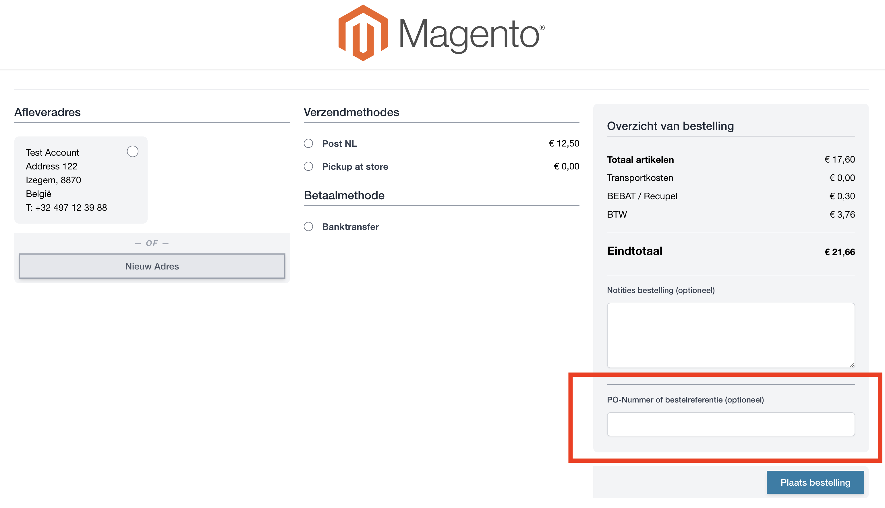
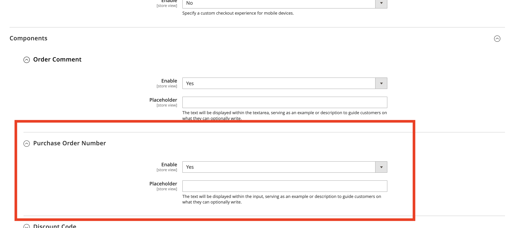
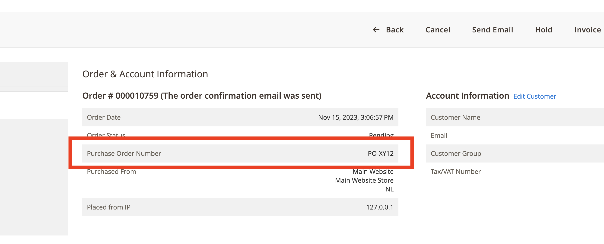

# HyvaCheckout_PurchaseOrderNumber

This is a Magento module specific for Hyvä Checkout, which adds a custom field Purchase Order Number to [Hyvä Checkout](https://www.hyva.io/hyva-checkout.html).

## Installation

To install the HyvaCheckout_PurchaseOrderNumber module via composer, run the following command:

```bash
composer require friends-of-hyva/purchase-order-number
```

**Minimum requirements for this module Hyvä Theme 1.3.0, Hyvä Checkout 1.1 or higher**

## PurchaseOrderNumber

The "Purchase Order Number" field will be added to the right column of your shopping cart overview. The field will automatically appear below the "Order Comments".



If you go to the admin panel, you can switch the field on and off via the Hyva Checkout settings. You can also set a "Placeholder" text that will be displayed in the field.



After placing an order, you can see the "Purchase Order Number" when you open the order in the admin panel. You can also use the variable purchase_order_number in the email template after placing your order.



## Note

This module is made specific for Hyvä Checkout and doesn't work with native Magento.

For more information on Hyvä, please visit the [official Hyvä website](https://hyva.io/). Thank you to the Hyva Community on Slack for the feedback.

## Copyright & License

Copyright (c) 2023 Pieter Cappelle & Friends of Hyvä

The module is released under the [MIT](LICENSE.txt).
